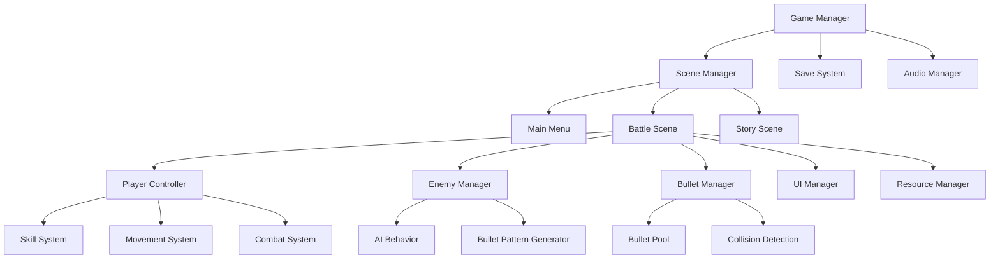

# Design Document

## Overview

FEZ: Chronicle of the Players 是一款基於 Godot Engine 開發的 2D 像素風格彈幕射擊遊戲。遊戲採用模組化架構設計，支援多職業系統、動態彈幕生成、資源管理和劇情推進。設計重點在於創造高挑戰性的戰鬥體驗，同時保持代碼的可維護性和擴展性。

## Architecture

### 系統架構圖



### 核心系統分層

1. **管理層 (Management Layer)**
   - GameManager: 全域遊戲狀態管理
   - SceneManager: 場景切換和載入
   - SaveSystem: 存檔和進度管理

2. **遊戲邏輯層 (Game Logic Layer)**
   - PlayerController: 玩家控制和狀態
   - EnemyManager: 敵人生成和管理
   - BulletManager: 彈幕系統管理

3. **表現層 (Presentation Layer)**
   - UIManager: 使用者介面
   - AudioManager: 音效和音樂
   - VisualEffects: 視覺特效

## Components and Interfaces

### 玩家系統 (Player System)

#### PlayerController
```gdscript
# 核心玩家控制器介面
class_name PlayerController
extends CharacterBody2D

# 玩家狀態 - 使用字典和類型提示
var stats = {
    "hp": 1000,
    "sp": 100, 
    "cost": 150,
    "max_hp": 1000,
    "max_sp": 100,
    "max_cost": 150
}

var state = {
    "is_casting": false,
    "is_invulnerable": false,
    "is_dodging": false,
    "current_job": JobType.WARRIOR
}

# 移動配置 - 使用字典組織相關參數
var movement_config = {
    "move_speed": 200.0,
    "dodge_speed": 400.0,
    "dodge_duration": 0.3,
    "dodge_cooldown": 1.0
}

# 組件引用 - 使用更 Pythonic 的命名
var skill_system: SkillSystem
var resource_manager: ResourceManager
```

#### MovementSystem
```gdscript
# 八方向移動系統 - 使用 Python 風格的方法組織
class_name MovementSystem
extends Node

# 移動方向映射 - 使用字典和向量
var direction_map = {
    "up": Vector2.UP,
    "down": Vector2.DOWN, 
    "left": Vector2.LEFT,
    "right": Vector2.RIGHT,
    "up_left": Vector2.UP + Vector2.LEFT,
    "up_right": Vector2.UP + Vector2.RIGHT,
    "down_left": Vector2.DOWN + Vector2.LEFT,
    "down_right": Vector2.DOWN + Vector2.RIGHT
}

func get_input_direction() -> Vector2:
    """獲取輸入方向向量"""
    pass

func handle_movement(delta: float) -> Vector2:
    """處理玩家移動邏輯"""
    pass
    
func execute_dodge() -> void:
    """執行閃避動作"""
    pass
    
def apply_movement_modifiers(base_speed: float) -> float:
    """應用移動速度修正"""
    pass
```

#### SkillSystem
```gdscript
# 技能系統基礎架構 - 使用 Python 風格的數據結構
class_name SkillSystem
extends Node

# 技能數據 - 使用字典組織
var skills_data = {}
var skill_cooldowns = {}
var active_effects = []

# 職業技能映射
var job_skills = {
    JobType.WARRIOR: ["sonic_boom", "force_impact", "shield_bash"],
    JobType.SCOUT: ["arrow_rain", "poison_shot", "hide"],
    JobType.SORCERER: ["lightning", "fire", "chant"],
    JobType.CESTUS: ["harm_activate", "sacrifice", "style_switch"],
    JobType.FENCER: ["flash_stinger", "acceleration", "duel"]
}

func cast_skill(skill_name: String) -> bool:
    """施放指定技能"""
    if not can_cast_skill(skill_name):
        return false
    
    var skill = skills_data[skill_name]
    return _execute_skill_cast(skill)

func can_cast_skill(skill_name: String) -> bool:
    """檢查是否可以施放技能"""
    return (skill_name in skills_data and 
            not _is_on_cooldown(skill_name) and
            _has_sufficient_resources(skills_data[skill_name]))

func _is_on_cooldown(skill_name: String) -> bool:
    """檢查技能冷卻狀態"""
    return skill_name in skill_cooldowns and skill_cooldowns[skill_name] > 0
```

### 敵人系統 (Enemy System)

#### EnemyController
```gdscript
# 敵人基礎控制器
class_name EnemyController
extends CharacterBody2D

var hp: int
var move_pattern: MovementPattern
var attack_pattern: AttackPattern
var ai_state: AIState

func update_ai(delta: float) -> void
func execute_attack() -> void
func take_damage(amount: int) -> void
```

#### BulletPatternGenerator
```gdscript
# 彈幕模式生成器 - 使用 Python 風格的模式定義
class_name BulletPatternGenerator
extends Node

# 彈幕模式配置 - 使用字典定義模式參數
var pattern_configs = {
    "straight": {
        "bullet_count": 1,
        "spread_angle": 0,
        "speed": 300,
        "generator_func": "_generate_straight_pattern"
    },
    "spiral": {
        "bullet_count": 8,
        "rotation_speed": 90,
        "speed": 200,
        "generator_func": "_generate_spiral_pattern"
    },
    "spread": {
        "bullet_count": 5,
        "spread_angle": 45,
        "speed": 250,
        "generator_func": "_generate_spread_pattern"
    },
    "homing": {
        "bullet_count": 3,
        "homing_strength": 0.1,
        "speed": 150,
        "generator_func": "_generate_homing_pattern"
    }
}

func generate_pattern(pattern_name: String, custom_params: Dictionary = {}) -> Array:
    """生成指定模式的彈幕"""
    if pattern_name not in pattern_configs:
        push_error(f"Unknown pattern: {pattern_name}")
        return []
    
    var config = pattern_configs[pattern_name].duplicate()
    # 合併自定義參數
    for key in custom_params:
        config[key] = custom_params[key]
    
    var generator_func = config["generator_func"]
    return call(generator_func, config)

func _generate_straight_pattern(config: Dictionary) -> Array:
    """生成直線彈幕模式"""
    pass

func _generate_spiral_pattern(config: Dictionary) -> Array:
    """生成螺旋彈幕模式"""
    pass
```

### 彈幕系統 (Bullet System)

#### BulletManager
```gdscript
# 彈幕管理器
class_name BulletManager
extends Node

var bullet_pool: BulletPool
var active_bullets: Array[Bullet]
var max_bullets: int = 1000

func spawn_bullet(type: BulletType, position: Vector2, direction: Vector2) -> Bullet
func update_bullets(delta: float) -> void
func clear_bullets() -> void
```

#### Bullet
```gdscript
# 彈幕基礎類別
class_name Bullet
extends Area2D

var speed: float
var direction: Vector2
var damage: int
var bullet_type: BulletType
var lifetime: float

func move(delta: float) -> void
func on_collision(body: Node2D) -> void
```

### 資源管理系統 (Resource Management)

#### ResourceManager
```gdscript
# 資源管理器
class_name ResourceManager
extends Node

signal hp_changed(new_hp: int)
signal sp_changed(new_sp: int)
signal cost_changed(new_cost: int)

func modify_hp(amount: int) -> void
func modify_sp(amount: int) -> void
func use_item(item: Item) -> bool
func can_use_item(item: Item) -> bool
```

## Data Models

### 職業系統數據模型

```gdscript
# 職業類型枚舉
enum JobType {
    WARRIOR,    # 戰士
    SCOUT,      # 遊俠  
    SORCERER,   # 魔導師
    CESTUS,     # 拳鬥士
    FENCER      # 擊劍士
}

# 技能數據結構 - 使用字典和類型提示
class_name SkillData
extends Resource

# 使用 Python 風格的數據結構
var skill_info = {
    "id": 0,
    "name": "",
    "description": "",
    "costs": {
        "sp": 0,
        "pw": 0
    },
    "effects": {
        "damage": 0,
        "cast_time": 0.0,
        "cooldown": 0.0,
        "duration": 0.0
    },
    "properties": {
        "skill_type": "",
        "target_type": "",
        "range": 0.0,
        "area_of_effect": 0.0
    },
    "status_effects": []
}

func from_dict(data: Dictionary) -> SkillData:
    """從字典創建技能數據"""
    var skill = SkillData.new()
    skill.skill_info = data
    return skill

func to_dict() -> Dictionary:
    """轉換為字典格式"""
    return skill_info.duplicate(true)
```

### 關卡數據模型

```gdscript
# 關卡類型
enum LevelType {
    ATTACK,     # 攻擊模式
    DEFENSE,    # 防守模式
    ESCORT      # 護送模式
}

# 關卡配置
class_name LevelConfig
extends Resource

@export var level_id: int
@export var level_name: String
@export var level_type: LevelType
@export var enemy_waves: Array[EnemyWave]
@export var objectives: Array[Objective]
@export var background_music: AudioStream
@export var background_scene: PackedScene
```

### 敵人數據模型

```gdscript
# 敵人配置
class_name EnemyConfig
extends Resource

@export var enemy_id: int
@export var name: String
@export var hp: int
@export var speed: float
@export var attack_patterns: Array[AttackPattern]
@export var movement_pattern: MovementPattern
@export var sprite_texture: Texture2D
@export var crystal_drop_amount: int
```

## Error Handling

### 錯誤處理策略

1. **遊戲狀態錯誤**
   - 使用狀態機模式確保狀態轉換的安全性
   - 實作狀態驗證機制防止非法狀態轉換

2. **資源載入錯誤**
   - 實作資源預載入系統
   - 提供備用資源防止載入失敗

3. **存檔系統錯誤**
   - 實作存檔備份機制
   - 提供存檔修復功能

```gdscript
# 錯誤處理管理器 - 使用 Python 風格的錯誤處理
class_name ErrorHandler
extends Node

# 錯誤類型配置
var error_configs = {
    "resource_load_failed": {
        "severity": "high",
        "retry_count": 3,
        "fallback_action": "_load_default_resource"
    },
    "save_corrupted": {
        "severity": "medium", 
        "retry_count": 1,
        "fallback_action": "_restore_backup_save"
    },
    "invalid_state": {
        "severity": "low",
        "retry_count": 0,
        "fallback_action": "_reset_to_safe_state"
    }
}

func handle_error(error_type: String, context: Dictionary = {}) -> bool:
    """處理錯誤並返回是否成功恢復"""
    if error_type not in error_configs:
        push_error(f"Unknown error type: {error_type}")
        return false
    
    var config = error_configs[error_type]
    var retry_count = config.get("retry_count", 0)
    
    for attempt in range(retry_count + 1):
        if _try_recover_error(error_type, config, context):
            return true
        
        if attempt < retry_count:
            await get_tree().create_timer(0.1 * (attempt + 1)).timeout
    
    # 執行備用方案
    return call(config["fallback_action"], context)

func log_error(message: String, severity: String = "medium", context: Dictionary = {}) -> void:
    """記錄錯誤信息"""
    var timestamp = Time.get_datetime_string_from_system()
    var log_entry = {
        "timestamp": timestamp,
        "message": message,
        "severity": severity,
        "context": context
    }
    
    print(f"[{severity.to_upper()}] {timestamp}: {message}")
    if context:
        print(f"Context: {context}")
```

## Testing Strategy

### 單元測試

1. **核心系統測試**
   - PlayerController 移動和戰鬥邏輯
   - SkillSystem 技能施放和效果
   - ResourceManager 資源計算和限制

2. **彈幕系統測試**
   - BulletManager 彈幕生成和回收
   - 碰撞檢測準確性
   - 性能壓力測試

### 整合測試

1. **遊戲流程測試**
   - 關卡載入和切換
   - 存檔和讀取功能
   - UI 互動響應

2. **平衡性測試**
   - 技能傷害和消耗平衡
   - 敵人難度曲線
   - 資源獲取和消耗比例

### 性能測試

```gdscript
# 性能監控器
class_name PerformanceMonitor
extends Node

var frame_time_history: Array[float] = []
var bullet_count_peak: int = 0
var memory_usage_peak: int = 0

func update_metrics(delta: float) -> void
func log_performance_data() -> void
func detect_performance_issues() -> Array[String]
```

## 技術實作細節

### 彈幕系統優化

1. **物件池模式**
   - 預先創建彈幕物件池避免頻繁記憶體分配
   - 實作高效的物件回收機制

2. **空間分割**
   - 使用四叉樹或網格系統優化 2D 碰撞檢測
   - 實作螢幕邊界剔除減少不必要的更新

3. **批次處理**
   - 將相同類型的彈幕進行批次更新
   - 使用 Sprite2D 批次渲染優化 2D 性能

### 音效系統設計

```gdscript
# 音效管理器
class_name AudioManager
extends Node

var bgm_player: AudioStreamPlayer
var sfx_players: Array[AudioStreamPlayer]
var audio_pools: Dictionary = {}

func play_bgm(stream: AudioStream, fade_in: bool = true) -> void
func play_sfx(stream: AudioStream, volume: float = 1.0) -> void
func stop_all_audio() -> void
```

### 存檔系統架構

```gdscript
# 存檔管理器
class_name SaveSystem
extends Node

const SAVE_FILE_PATH = "user://savegame.dat"
const BACKUP_FILE_PATH = "user://savegame_backup.dat"

func save_game(data: GameData) -> bool
func load_game() -> GameData
func create_backup() -> void
func restore_from_backup() -> bool
```

## UI/UX 設計規範

### HUD 設計

1. **資源顯示**
   - HP: 紅色血條，位於螢幕左上角
   - SP: 藍色能量條，位於 HP 下方
   - Cost: 黃色資源條，位於 SP 下方

2. **技能介面**
   - 技能圖示排列在螢幕下方
   - 顯示冷卻時間和消耗資源
   - 支援快捷鍵和滑鼠點擊

3. **小地圖**
   - 顯示敵人位置和目標點
   - 支援縮放和拖拽

### 選單系統

```gdscript
# UI 管理器
class_name UIManager
extends CanvasLayer

var main_menu: MainMenu
var pause_menu: PauseMenu
var hud: GameHUD
var dialog_system: DialogSystem

func show_menu(menu_type: MenuType) -> void
func hide_current_menu() -> void
func update_hud(player_data: PlayerData) -> void
```

## 擴展性考量

### 模組化設計

1. **職業系統擴展**
   - 新職業只需實作 JobClass 介面
   - 技能系統支援動態載入新技能

2. **關卡編輯器**
   - 提供視覺化關卡編輯工具
   - 支援自定義敵人配置和彈幕模式

3. **本地化支援**
   - 文字資源外部化
   - 支援多語言切換

### 性能擴展

1. **多執行緒支援**
   - AI 計算可移至背景執行緒
   - 資源載入使用非同步處理

2. **記憶體管理**
   - 實作智慧資源卸載
   - 監控記憶體使用並提供警告

這個設計文件為 FEZ: Chronicle of the Players 提供了完整的技術架構基礎，確保遊戲能夠實現需求文件中定義的所有功能，同時保持良好的性能和可維護性。